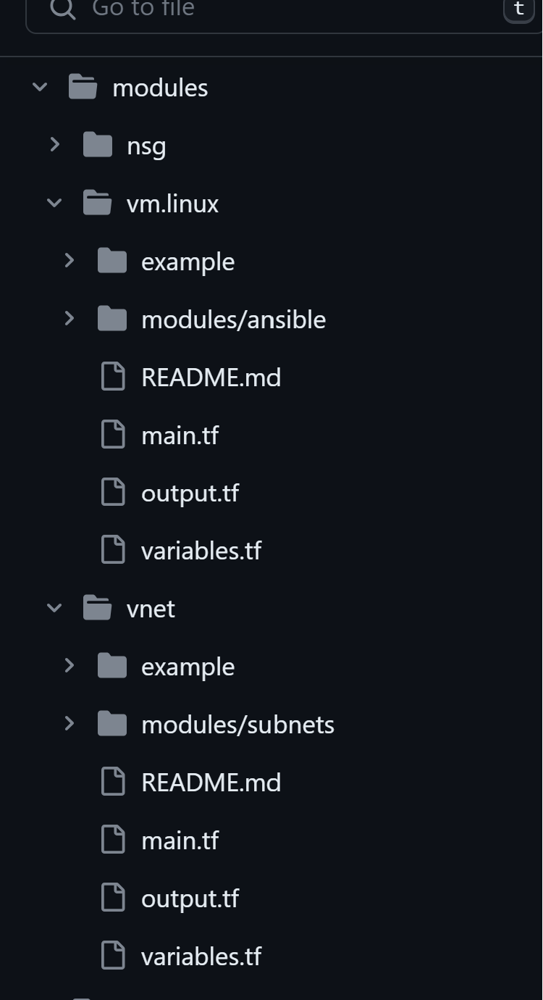
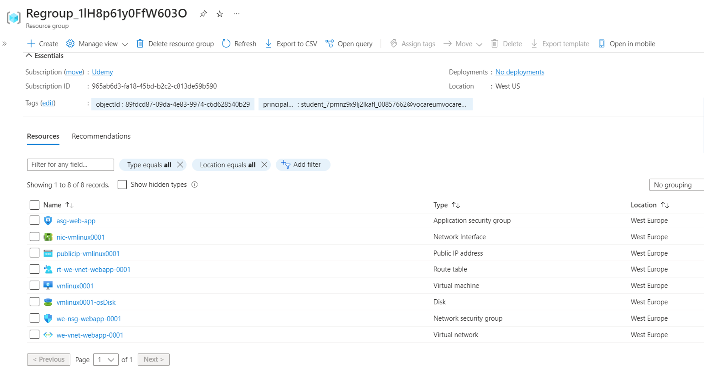
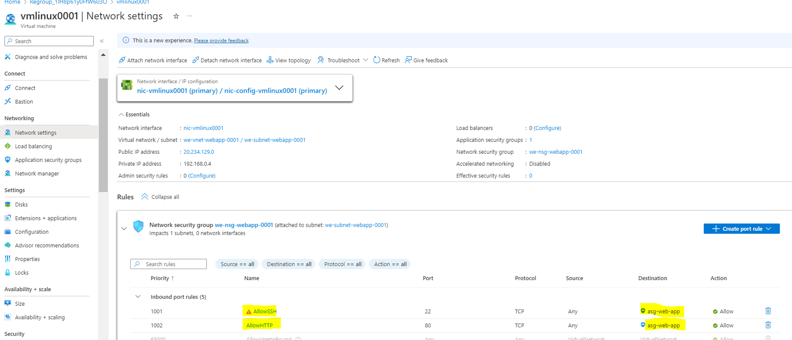
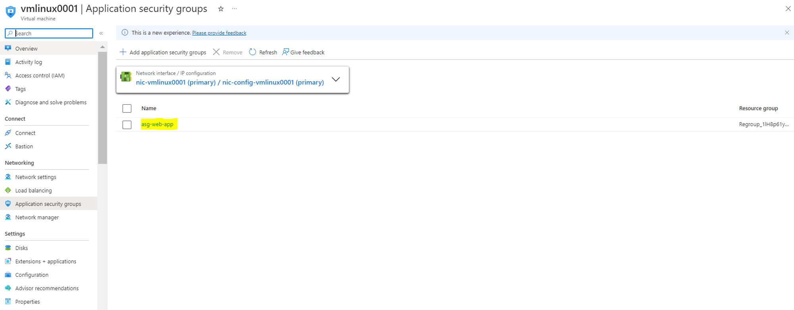
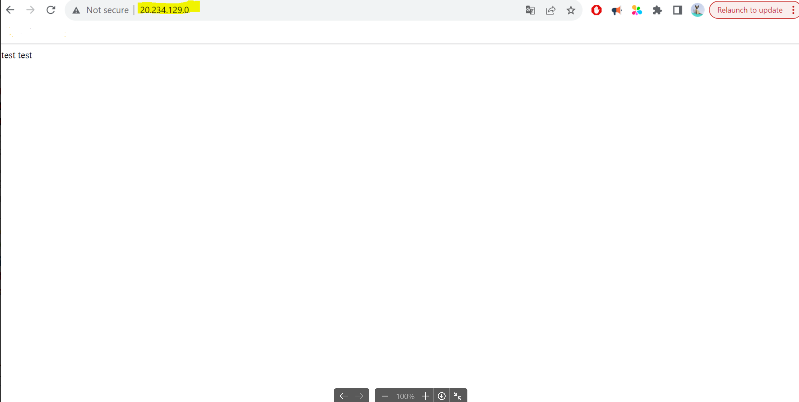

<!-- BEGIN_TF_DOCS -->

# Terraform Module: Deploy Ubuntu VM with Apache2

This Terraform module facilitates the streamlined deployment of an Ubuntu VM with an Apache2 web server. The module is structured to enhance modularity and adhere to best practices.

## Modules

1. **[NSG Module](modules/nsg):**
    - Creates a Network Security Group (NSG) and associates NSG rules.
    - Optional attachment of the NSG to an Application Security Group (ASG) for enhanced security.
    - [Please consult the module documentation for reference...](modules/nsg)

2. **[VNET Module](modules/vnet):**
    - Establishes a Virtual Network (VNET) with a designated subnet.
    - Creates a routing table and ensures proper attachment between the VNET and the subnet.
    - [Please consult the module documentation for reference...](modules/vnet)

3. **[VM.Linux Module](modules/vm.linux):**
    - Generates a Linux VM with customizable configurations.
    - Utilizes Ansible and Terraform for installing Apache2 and deploying of a static web app to the created server.
    - Configures a Network Interface Card (NIC) and attaches it to the VM.
    - Provides optional creation of public, private IP addresses.
    - Associate the Application Security Group (ASG) with the Virtual Machine (VM).
   - [Please consult the module documentation for reference...](modules/vm.linux)

## Folder Structure

The module follows the standard Terraform module structure, optimized for reuse and distribution in separate repositories. This structure enables easy interpretation by Terraform tooling, facilitating documentation generation, indexing for the module registry, and other functionalities.


## Documentation Generation

Documentation is automatically generated using the `terraform-docs` tool. This ensures clear and comprehensive documentation, helping users understand module usage, inputs, and other essential information.

## Getting Started

To use this module, refer to the documentation in each submodule folder. Detailed instructions and examples are provided to guide you through the deployment process.


## Requirements

| Name                                                                      | Version |
|---------------------------------------------------------------------------|---------|
| <a name="requirement_terraform"></a> [terraform](#requirement\_terraform) | >= 1.5 |
| <a name="requirement_azurerm"></a> [azurerm](#requirement\_azurerm)       | >= 3.41.0 |
| <a name="requirement_ansible"></a> [ansible](https://docs.ansible.com/ansible/latest/installation_guide/intro_installation.html)                                | >= 2.16.2 |

## Providers

| Name | Version |
|------|---------|
| <a name="provider_azuread"></a> [azuread](#provider\_azuread) | n/a |
| <a name="provider_azurerm"></a> [azurerm](#provider\_azurerm) | >= 3.41.0 |

## Modules

| Name | Source | Version |
|------|--------|---------|
| <a name="module_nsg"></a> [nsg](#module\_nsg) | git::https://github.com/hamzABellkhadir/Terraform.Azure.Modules.git//modules/nsg | n/a |
| <a name="module_vmlinux"></a> [vmlinux](#module\_vmlinux) | git::https://github.com/hamzABellkhadir/Terraform.Azure.Modules.git//modules/vm.linux | n/a |
| <a name="module_vnet"></a> [vnet](#module\_vnet) | git::https://github.com/hamzABellkhadir/Terraform.Azure.Modules.git//modules/vnet | n/a |


# Example Deployment of Apache2 into Azure VM

For a hands-on example of deploying Apache2 into an Azure VM using this module, navigate to the "example" folder within the module. Follow the outlined process below for a smooth execution:

## Process of Terraform Execution:

1. **[the Example folder](example):**
    - Navigate to the "example" folder in the module.

2. **Modify Default Variables:**
    - Ensure that you modify the default variables in the copied example file according to your requirements. Adjust variables such as subscription ID, resource group name, VM configuration, etc.

3. **Backend Configuration (Optional):**
    - If you want to store the Terraform state in a storage account, ensure to add the appropriate backend configuration. Modify the backend configuration in the example file accordingly.

4. **Execute Terraform Commands:**
    - Open a terminal and navigate to the location where you copied the example file.
    - Run the following Terraform commands in sequence:
      ```bash
      terraform init
      terraform plan
      terraform apply
      ```

5. **Automatic Infrastructure Creation:**
    - The execution of the Terraform commands will automatically create the defined infrastructure in Azure based on your configurations.

## Screenshot Result:











# Apache Server Management and Scaling

## Logging and Monitoring Implementation

### Logging

- Utilize centralized logging solutions or tools like ELK Stack or Azure Monitor to aggregate and analyze logs.

### Monitoring

- Define alerting policies based on predefined thresholds for key metrics like CPU usage, memory, and response times.
- Integrate with Azure Monitor for comprehensive insights.

## Backup Implementation

### Automated Backup Policies

- Create a backup policies to create the backup if note exist.
- Deploy a Recovery Services Vault to facilitate backup management.
- Ensure the inclusion of tags of the backup on virtual machines to enable Azure Policy to automatically create backups for the specified VMs.

## Scaling for Higher Availability and Load

### Load Balancing

- Deploy a load balancer to distribute incoming traffic across multiple instances of the Apache server.
- Implement load balancing policies to ensure even distribution and optimal resource utilization.

### Auto Scaling

- Utilize auto-scaling policies to dynamically adjust the number of Apache server instances based on traffic and performance metrics.
- Set up scaling policies to add or remove instances as needed.

<!-- END_TF_DOCS -->